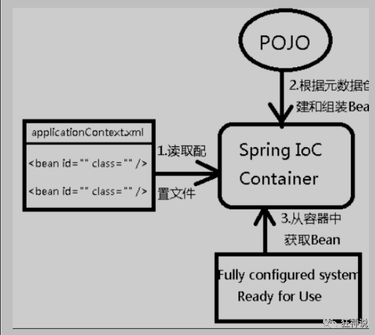

# 1. Spring
## 1.1. 简介

需要使用的 jar 包：
```xml
<!-- https://mvnrepository.com/artifact/org.springframework/spring-webmvc -->
<dependency>
    <groupId>org.springframework</groupId>
    <artifactId>spring-webmvc</artifactId>
    <version>5.2.0.RELEASE</version>
</dependency>

<!-- https://mvnrepository.com/artifact/org.springframework/spring-jdbc -->
<dependency>
    <groupId>org.springframework</groupId>
    <artifactId>spring-jdbc</artifactId>
    <version>5.1.20.RELEASE</version>
</dependency>

```
## 1.2. 优点

1. Spring 是一个开源的框架（容器）。
2. Spring 是一个轻量级， 非侵入式的框架。
3. 控制反转 （IOC）， 面向切面编程 （AOP）.
4. 支持事务的处理， 对框架整合支持。

Spring 是一个轻量级的控制反转和面向切面编程的框架。

## 1.3. 组成


# 2. IOC 理论

```java
public class UserServiceImpl implements UserService {

    /**
     * 这种方式每次增加一种dao接口， 就必须改动代码， 耦合性很高.
     */
    //private UserDao userDao = new UserDaoImpl();
    private UserDao userDao = new UserDaoMySqlImpl();
    
    @Override
    public void getUser() {
        userDao.getUser();
    }
}
```

我们这里采用依赖注入的方式， 级增加一个set方法接口， 让用户自己传入需要使用的Dao方式。
```java
public class UserServiceImpl implements UserService {
    private UserDao userDao;

    /**
     * 使用set方法， 自定义传入Dao 种类
     * @param userDao
     */
    public void setUserDao(UserDao userDao) {
        this.userDao = userDao;
    }

    @Override
    public void getUser() {
        userDao.getUser();
    }
}
```

```java
public class IoCTest {

    /**
     * 原始获得用户的方式, 只能获取指定方式的Dao， 耦合性较高
     */
    @Test
    public void testOrigin() {
        UserService userService = new UserServiceImpl();
        userService.getUser();
    }

    @Test
    public void testUseSetMethod() {
        UserServiceImpl userService = new UserServiceImpl();
        // 使用MySQL
        userService.setUserDao(new UserDaoMySqlImpl());
        userService.getUser();

        // 使用Oracle
        userService.setUserDao(new UserDaoOracleImpl());
        userService.getUser();
    }

}

```
**IoC是Spring框架的核心内容**，使用多种方式完美的实现了IoC，可以使用XML配置，也可以使用注解，新版本的Spring也可以零配置实现IoC。

Spring容器在初始化时先读取配置文件，根据配置文件或元数据创建与组织对象存入容器中，程序使用时再从Ioc容器中取出需要的对象。



采用XML方式配置Bean的时候，Bean的定义信息是和实现分离的，而采用注解的方式可以把两者合为一体，Bean的定义信息直接以注解的形式定义在实现类中，从而达到了零配置的目的。

**控制反转是一种通过描述（XML或注解）并通过第三方去生产或获取特定对象的方式。在Spring中实现控制反转的是IoC容器，其实现方法是依赖注入（Dep**endency Injection,DI）。

## 2.1 IoC 创建对象方式
在使用 `getBean()` 的时候 Spring 就已经通过无参构造函数为我们创建了一个 Bean 对象。 实际情况是， 在配置文件加载的时候， 其中管理的对象就已经开始初始化。

当然我们还可以使用有参构造函数来创建， 但是在 xml 文件中必须指定相应参数的值。

```xml
<!-- 第一种根据index参数下标设置 -->
<bean id="userT" class="com.kuang.pojo.UserT">
    <!-- index指构造方法 , 下标从0开始 -->
    <constructor-arg index="0" value="kuangshen2"/>
</bean>

        <!-- 第二种根据参数名字设置 -->
<bean id="userT" class="com.kuang.pojo.UserT">
    <!-- name指参数名 -->
    <constructor-arg name="name" value="kuangshen2"/>
</bean>
        
        <!-- 第三种根据参数类型设置 -->
<bean id="userT" class="com.kuang.pojo.UserT">
    <constructor-arg type="java.lang.String" value="kuangshen2"/>
</bean>
```


# Spring 配置

## 别名

```xml
<?xml version="1.0" encoding="UTF-8"?>
<beans xmlns="http://www.springframework.org/schema/beans"
       xmlns:xsi="http://www.w3.org/2001/XMLSchema-instance"
       xsi:schemaLocation="http://www.springframework.org/schema/beans
        https://www.springframework.org/schema/beans/spring-beans.xsd">

    <bean id="User" class="com.peter.pojo.User">
        <!-- collaborators and configuration for this bean go here -->
        <property name="name" value="Spring"/>
    </bean>
    
    <!--别名-->
    <alias name="User" alias="user"/>

</beans>
```

## Bean 的配置
```xml
<?xml version="1.0" encoding="UTF-8"?>
<beans xmlns="http://www.springframework.org/schema/beans"
       xmlns:xsi="http://www.w3.org/2001/XMLSchema-instance"
       xsi:schemaLocation="http://www.springframework.org/schema/beans
        https://www.springframework.org/schema/beans/spring-beans.xsd">
    <!--
    id：Bean的唯一标识符， 相当于对象名
    class： Bean对象所对应的全限定名， 包名 + 类型
    name： 即别名
    -->
    <bean id="User" class="com.peter.pojo.User" name="u2">
        <!-- collaborators and configuration for this bean go here -->
        <property name="name" value="Spring"/>
    </bean>
</beans>
```
## import
一般用于团队开发， 可以将多个配置文件导入合并为一个。

```xml
<?xml version="1.0" encoding="UTF-8"?>
<beans xmlns="http://www.springframework.org/schema/beans"
       xmlns:xsi="http://www.w3.org/2001/XMLSchema-instance"
       xsi:schemaLocation="http://www.springframework.org/schema/beans
        https://www.springframework.org/schema/beans/spring-beans.xsd">
    
        <import resource="beans.xml"/>
        <import resource="beans2.xml"/>
</beans>
```

# 依赖注入 （DI）

- Dependency injection
- 依赖： Bean 对象的创建依赖于容器， Bean 对象的依赖资源。
- 注入： 指 Bean 对象所依赖的资源， 由容器来设置和装配。

## 构造器注入
即上文中提到的使用在xml文件中配置构造器参数来生成Bean对象。

## Set 注入
这里 Set 是指使用set方法， 即 `set + 属性首字母大写`. 如果属性是 boolean， 我们将 set 替换为 is。
### 常量 注入
```xml
 <bean id="student" class="com.kuang.pojo.Student">
     <property name="name" value="小明"/>
 </bean>
```

### Beans 注入
```xml
<bean id="Address" class="com.peter.pojo.Address">
        <property name="address" value="London"/>
</bean>

<bean id="Student" class="com.peter.pojo.Student">
    <property name="name" value="Tom"/>
    <!--Bean 注入 注意这里使用 ref-->
    <property name="address" ref="Address"/>
</bean>
```

### 数组 注入

```xml
<bean id="Student" class="com.peter.pojo.Student">
    <property name="name" value="Tom"/>
    <property name="address" ref="Address"/>
    <!--数组注入-->
    <property name="books">
        <array>
            <value>水浒</value>
            <value>红楼</value>
            <value>西游</value>
        </array>
    </property>
</bean>

```

### List 注入
```xml
<!--list 注入-->
<property name="hobbies">
    <list>
        <value>Play the piano</value>
        <value>Cooking</value>
    </list>
</property>

```


### Map 注入

```xml
<!--map 注入-->
<property name="card">
    <map>
        <entry key="China postOffice" value="14512211"/>
        <entry key="Construction" value="1326466"/>
    </map>
</property>
```

### Set 注入

```xml
<!--Set 注入-->
<property name="games">
    <set>
        <value>LoL</value>
        <value>Bob</value>
    </set>
</property>
```


### Null 注入

```xml
<!--null 注入-->
<property name="wife"><null></null></property>
```

### Properties 注入
```xml
<!--properties 注入-->
<property name="info">
    <props>
        <prop key="Id">2021165</prop>
        <prop key="Gender">Male</prop>
        <prop key="Name">Tom</prop>
    </props>
</property>
```

