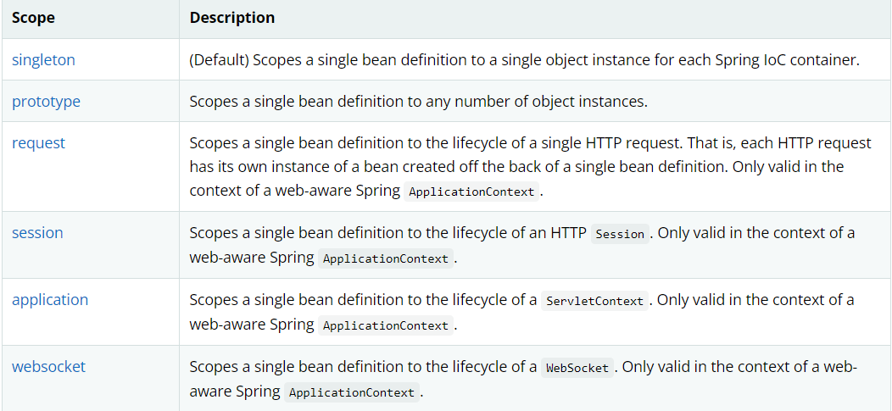

# 1. Spring
## 1.1. 简介

需要使用的 jar 包：
```xml
<!-- https://mvnrepository.com/artifact/org.springframework/spring-webmvc -->
<dependency>
    <groupId>org.springframework</groupId>
    <artifactId>spring-webmvc</artifactId>
    <version>5.2.0.RELEASE</version>
</dependency>

<!-- https://mvnrepository.com/artifact/org.springframework/spring-jdbc -->
<dependency>
    <groupId>org.springframework</groupId>
    <artifactId>spring-jdbc</artifactId>
    <version>5.1.20.RELEASE</version>
</dependency>

```
## 1.2. 优点

1. Spring 是一个开源的框架（容器）。
2. Spring 是一个轻量级， 非侵入式的框架。
3. 控制反转 （IOC）， 面向切面编程 （AOP）.
4. 支持事务的处理， 对框架整合支持。

Spring 是一个轻量级的控制反转和面向切面编程的框架。

## 1.3. 组成


# 2. IOC 理论

```java
public class UserServiceImpl implements UserService {

    /**
     * 这种方式每次增加一种dao接口， 就必须改动代码， 耦合性很高.
     */
    //private UserDao userDao = new UserDaoImpl();
    private UserDao userDao = new UserDaoMySqlImpl();
    
    @Override
    public void getUser() {
        userDao.getUser();
    }
}
```

我们这里采用依赖注入的方式， 级增加一个set方法接口， 让用户自己传入需要使用的Dao方式。
```java
public class UserServiceImpl implements UserService {
    private UserDao userDao;

    /**
     * 使用set方法， 自定义传入Dao 种类
     * @param userDao
     */
    public void setUserDao(UserDao userDao) {
        this.userDao = userDao;
    }

    @Override
    public void getUser() {
        userDao.getUser();
    }
}
```

```java
public class IoCTest {

    /**
     * 原始获得用户的方式, 只能获取指定方式的Dao， 耦合性较高
     */
    @Test
    public void testOrigin() {
        UserService userService = new UserServiceImpl();
        userService.getUser();
    }

    @Test
    public void testUseSetMethod() {
        UserServiceImpl userService = new UserServiceImpl();
        // 使用MySQL
        userService.setUserDao(new UserDaoMySqlImpl());
        userService.getUser();

        // 使用Oracle
        userService.setUserDao(new UserDaoOracleImpl());
        userService.getUser();
    }

}

```
**IoC是Spring框架的核心内容**，使用多种方式完美的实现了IoC，可以使用XML配置，也可以使用注解，新版本的Spring也可以零配置实现IoC。

Spring容器在初始化时先读取配置文件，根据配置文件或元数据创建与组织对象存入容器中，程序使用时再从Ioc容器中取出需要的对象。


采用XML方式配置Bean的时候，Bean的定义信息是和实现分离的，而采用注解的方式可以把两者合为一体，Bean的定义信息直接以注解的形式定义在实现类中，从而达到了零配置的目的。

**控制反转是一种通过描述（XML或注解）并通过第三方去生产或获取特定对象的方式。在Spring中实现控制反转的是IoC容器，其实现方法是依赖注入（Dep**endency Injection,DI）。

## 2.1 IoC 创建对象方式
在使用 `getBean()` 的时候 Spring 就已经通过无参构造函数为我们创建了一个 Bean 对象。 实际情况是， 在配置文件加载的时候， 其中管理的对象就已经开始初始化。

当然我们还可以使用有参构造函数来创建， 但是在 xml 文件中必须指定相应参数的值。

```xml
<!-- 第一种根据index参数下标设置 -->
<bean id="userT" class="com.kuang.pojo.UserT">
    <!-- index指构造方法 , 下标从0开始 -->
    <constructor-arg index="0" value="kuangshen2"/>
</bean>

        <!-- 第二种根据参数名字设置 -->
<bean id="userT" class="com.kuang.pojo.UserT">
    <!-- name指参数名 -->
    <constructor-arg name="name" value="kuangshen2"/>
</bean>
        
        <!-- 第三种根据参数类型设置 -->
<bean id="userT" class="com.kuang.pojo.UserT">
    <constructor-arg type="java.lang.String" value="kuangshen2"/>
</bean>
```


# 3. Spring 配置

## 3.1 别名

```xml
<?xml version="1.0" encoding="UTF-8"?>
<beans xmlns="http://www.springframework.org/schema/beans"
       xmlns:xsi="http://www.w3.org/2001/XMLSchema-instance"
       xsi:schemaLocation="http://www.springframework.org/schema/beans
        https://www.springframework.org/schema/beans/spring-beans.xsd">

    <bean id="User" class="com.peter.pojo.User">
        <!-- collaborators and configuration for this bean go here -->
        <property name="name" value="Spring"/>
    </bean>
    
    <!--别名-->
    <alias name="User" alias="user"/>

</beans>
```

## 3.2 Bean 的配置
```xml
<?xml version="1.0" encoding="UTF-8"?>
<beans xmlns="http://www.springframework.org/schema/beans"
       xmlns:xsi="http://www.w3.org/2001/XMLSchema-instance"
       xsi:schemaLocation="http://www.springframework.org/schema/beans
        https://www.springframework.org/schema/beans/spring-beans.xsd">
    <!--
    id：Bean的唯一标识符， 相当于对象名
    class： Bean对象所对应的全限定名， 包名 + 类型
    name： 即别名
    -->
    <bean id="User" class="com.peter.pojo.User" name="u2">
        <!-- collaborators and configuration for this bean go here -->
        <property name="name" value="Spring"/>
    </bean>
</beans>
```
## 3.3 import
一般用于团队开发， 可以将多个配置文件导入合并为一个。

```xml
<?xml version="1.0" encoding="UTF-8"?>
<beans xmlns="http://www.springframework.org/schema/beans"
       xmlns:xsi="http://www.w3.org/2001/XMLSchema-instance"
       xsi:schemaLocation="http://www.springframework.org/schema/beans
        https://www.springframework.org/schema/beans/spring-beans.xsd">
    
        <import resource="beans.xml"/>
        <import resource="beans2.xml"/>
</beans>
```

# 4.依赖注入 （DI）

- Dependency injection
- 依赖： Bean 对象的创建依赖于容器， Bean 对象的依赖资源。
- 注入： 指 Bean 对象所依赖的资源， 由容器来设置和装配。

## 4.1 构造器注入
即上文中提到的使用在xml文件中配置构造器参数来生成Bean对象。

## 4.2 Set 注入
这里 Set 是指使用set方法， 即 `set + 属性首字母大写`. 如果属性是 boolean， 我们将 set 替换为 is。
### 4.2.1 常量 注入
```xml
 <bean id="student" class="com.kuang.pojo.Student">
     <property name="name" value="小明"/>
 </bean>
```

### 4.2.2 Beans 注入
```xml
<bean id="Address" class="com.peter.pojo.Address">
        <property name="address" value="London"/>
</bean>

<bean id="Student" class="com.peter.pojo.Student">
    <property name="name" value="Tom"/>
    <!--Bean 注入 注意这里使用 ref-->
    <property name="address" ref="Address"/>
</bean>
```

### 4.2.3 数组 注入

```xml
<bean id="Student" class="com.peter.pojo.Student">
    <property name="name" value="Tom"/>
    <property name="address" ref="Address"/>
    <!--数组注入-->
    <property name="books">
        <array>
            <value>水浒</value>
            <value>红楼</value>
            <value>西游</value>
        </array>
    </property>
</bean>

```

### 4.2.4 List 注入
```xml
<!--list 注入-->
<property name="hobbies">
    <list>
        <value>Play the piano</value>
        <value>Cooking</value>
    </list>
</property>

```


### 4.2.5 Map 注入

```xml
<!--map 注入-->
<property name="card">
    <map>
        <entry key="China postOffice" value="14512211"/>
        <entry key="Construction" value="1326466"/>
    </map>
</property>
```

### 4.2.6 Set 注入

```xml
<!--Set 注入-->
<property name="games">
    <set>
        <value>LoL</value>
        <value>Bob</value>
    </set>
</property>
```


### 4.2.7 Null 注入

```xml
<!--null 注入-->
<property name="wife"><null></null></property>
```

### 4.2.8 Properties 注入
```xml
<!--properties 注入-->
<property name="info">
    <props>
        <prop key="Id">2021165</prop>
        <prop key="Gender">Male</prop>
        <prop key="Name">Tom</prop>
    </props>
</property>
```

## 4.3 p-namespace 和 c-namespace 注入

注意：
- 这两种方式都是利用 pojo 类的构造器进行注入。 其中 `p-namespace` 利用无参构造器， `c-namepsace` 利用有参构造器。
- 使用前都必须在 xml 文件中写上相应的限定
```xml
    <!--p-namespace -->
    xmlns:p="http://www.springframework.org/schema/p"
    <!--c-namespace-->
    xmlns:c="http://www.springframework.org/schema/c"
```

### 4.3.1 书写格式

```xml
<?xml version="1.0" encoding="UTF-8"?>
<beans xmlns="http://www.springframework.org/schema/beans"
       xmlns:xsi="http://www.w3.org/2001/XMLSchema-instance"
       xmlns:p="http://www.springframework.org/schema/p"
       xmlns:c="http://www.springframework.org/schema/c"
       xsi:schemaLocation="http://www.springframework.org/schema/beans
        https://www.springframework.org/schema/beans/spring-beans.xsd">

    <!--p namesapce-->
    <bean id="user" class="com.peter.pojo.User" p:name="Tom" p:age="18" scope="singleton"/>
    
    <!--c-namespace-->
    <bean id="user2" class="com.peter.pojo.User" c:name="Tom2" c:age="20"/>
</beans>
```
## 4.4 Bean 作用域



- 一般单线程种使用 singleton 较多， 多线程使用 prototype 较多。
- request、session、 application、websocket 作用域仅在基于web的应用中使用（不必关心你所采用的是什么web应用框架），只能用在基于web的Spring ApplicationContext环境。

### 4.4.1 Singleton 
当一个bean的作用域为Singleton，那么Spring IoC容器中只会存在一个共享的bean实例，并且所有对bean的请求，只要id与该bean定义相匹配，则只会返回bean的同一实例。Singleton是单例类型，就是在创建起容器时就同时自动创建了一个bean的对象，不管你是否使用，他都存在了，每次获取到的对象都是同一个对象。注意，Singleton作用域是Spring中的缺省作用域。要在XML中将bean定义成singleton，可以这样配置：
```xml
 <bean id="user" class="com.peter.pojo.User" p:name="Tom" p:age="18" scope="singleton"/>
```

### 4.4.2  Prototype
当一个bean的作用域为Prototype，表示一个bean定义对应多个对象实例。Prototype作用域的bean会导致在每次对该bean请求（将其注入到另一个bean中，
或者以程序的方式调用容器的getBean()方法）时都会创建一个新的bean实例。Prototype是原型类型，它在我们创建容器的时候并没有实例化，而是当我们获取bean
的时候才会去创建一个对象，而且我们每次获取到的对象都不是同一个对象。根据经验，对有状态的bean应该使用prototype作用域，而对无状态的bean则应该使用
singleton作用域。在XML中将bean定义成prototype，可以这样配置：
```xml
 <bean id="user" class="com.peter.pojo.User" p:name="Tom" p:age="18" scope="prototype"/>
```

### 4.4.3 Request
当一个bean的作用域为Request，表示在一次HTTP请求中，一个bean定义对应一个实例；即每个HTTP请求都会有各自的bean实例，它们依据某个bean定义创建而成。
该作用域仅在基于web的Spring ApplicationContext情形下有效。考虑下面bean定义：
```xml
 <bean id="loginAction" class="cn.csdn.LoginAction" scope="request"/>
```
针对每次HTTP请求，Spring容器会根据loginAction bean的定义创建一个全新的LoginAction bean实例，且该loginAction bean实例仅在当前HTTP 
request内有效，因此可以根据需要放心的更改所建实例的内部状态，而其他请求中根据loginAction bean定义创建的实例，将不会看到这些特定于某个请求的状态变化。当处理请求结束，request作用域的bean实例将被销毁。

### 4.4.4 Session
当一个bean的作用域为Session，表示在一个HTTP Session中，一个bean定义对应一个实例。该作用域仅在基于web的Spring ApplicationContext情形下有效。
考虑下面bean定义：
```xml
 <bean id="userPreferences" class="com.foo.UserPreferences" scope="session"/>
```
针对某个HTTP Session，Spring容器会根据userPreferences bean定义创建一个全新的userPreferences bean实例，且该userPreferences bean
仅在当前HTTP Session内有效。与request作用域一样，可以根据需要放心的更改所创建实例的内部状态，而别的HTTP 
Session中根据userPreferences创建的实例，将不会看到这些特定于某个HTTP Session的状态变化。当HTTP 
Session最终被废弃的时候，在该HTTP Session作用域内的bean也会被废弃掉。

# 5 Bean 的自动装配

- 自动装配是 Spring 满足Bean 依赖的一种方式
- Spring 会在上下文中自动寻找， 并自动给 bean 装配属性

装配方式：
- 在 xml 中配置
- 在 java 中显式配置
- 隐式的自动装配 【Important】

## 5.1 ByName 自动装配

```xml
<!--
<bean id="person" class="com.peter.pojo.Person" autowire="byName">
    <property name="name" value="Tome"/>
</bean>
```

## 5.2 ByType 自动装配

```xml
<bean id="person" class="com.peter.pojo.Person" autowire="byType">
        <property name="name" value="Tome"/>
</bean>

```

总结：

- byName 的时候， 需要保证所有的bean 的id 唯一 ， 并且这个bean需要和自定注入的属性的set 方法的值一致！
- byType 的时候， 需要保证所有 bean 的 class 唯一， 并且这个bean 需要和自动注入的属性的类型一致！

## 5.3 使用注解实现自动装配

JDk 1.5 和 spring 2.5 开始就支持注解。


使用注解须知：
- 使用 context 约束
- 配置注解支持

```xml
<?xml version="1.0" encoding="UTF-8"?>
<beans xmlns="http://www.springframework.org/schema/beans"
    xmlns:xsi="http://www.w3.org/2001/XMLSchema-instance"
    xmlns:context="http://www.springframework.org/schema/context"
    xsi:schemaLocation="http://www.springframework.org/schema/beans
        https://www.springframework.org/schema/beans/spring-beans.xsd
        http://www.springframework.org/schema/context
        https://www.springframework.org/schema/context/spring-context.xsd">

    <!--配置注解支持-->
    <context:annotation-config/>

</beans>
```
`<context:annotation-config/>` 会自动实现如下的后处理

- @Autoweired:
  - 直接在属性上使用即可， 也可以在set方法上使用。
  - 使用 @Autoweired  可以不用编写set方法， 前提是自动装配的属性在IOC容器中存在， 且符合命名byName规范。
  - @Qualifier() 注解可以指定配置文件中的bean


# 6. 使用注解开发

Spring 在 4 之后需要导入 aop 依赖
 

## 6.1 Bean 的实现
在使用之前需要在xml配置文件中引入一个上文中出现的context约束。 同时我们还需要设定扫描包的路径

```xml
<?xml version="1.0" encoding="UTF-8"?>
<beans xmlns="http://www.springframework.org/schema/beans"
       xmlns:xsi="http://www.w3.org/2001/XMLSchema-instance"
       xmlns:context="http://www.springframework.org/schema/context"
       xsi:schemaLocation="http://www.springframework.org/schema/beans
        https://www.springframework.org/schema/beans/spring-beans.xsd
        http://www.springframework.org/schema/context
        https://www.springframework.org/schema/context/spring-context.xsd">

    <!--指定注解扫描包-->
    <context:component-scan base-package="com.peter.pojo"/>
    <context:annotation-config/>

</beans>
```

在指定类下添加注解
```java
// 相当于xml配置文件中 <bean id="user", class="com.peter.pojo.User"/>
@Component("user")
public class User {
    public String name = "Tom";

    public String getName() {
        return name;
    }

    public void setName(String name) {
        this.name = name;
    }

    @Override
    public String toString() {
        return "User{" +
                "name='" + name + '\'' +
                '}';
    }
}
```

## 6.2 属性注入
可以不使用set方法， 直接在属性名上添加 @Value() 注解

```java
@Component("user")
public class User {
    
    @Value("Tom")
    public String name;
}
```
如果提供了set方法， 则可以在set方法上添加 @Value() 注解。

## 6.3 @Component 衍生注解
- @Controller: web layer
- @Service: service layer
- Repository: Dao layer

## 6.4 Scope 作用域

使用注解 @Scope 用来指定Bean的作用域：
- singleton：默认的，Spring会采用单例模式创建这个对象。关闭工厂 ，所有的对象都会销毁。
- prototype：多例模式。关闭工厂 ，所有的对象不会销毁。内部的垃圾回收机制会回收

```java
@Component
@Scope("prototype")
public class User {

  @Value("Tome")
  public String name;
}
```

## 6.5 小结

XML与注解比较
- XML可以适用任何场景 ，结构清晰，维护方便
- 注解不是自己提供的类使用不了，开发简单方便

xml与注解整合开发 ：推荐最佳实践
- xml管理Bean
- 注解完成属性注入
- 使用过程中， 可以不用扫描，扫描是为了类上的注解

`<context:annotation-config/>`作用：
- 进行注解驱动注册，从而使注解生效
- 用于激活那些已经在spring容器里注册过的bean上面的注解，也就是显示的向Spring注册
- 如果不扫描包，就需要手动配置bean
- 如果不加注解驱动，则注入的值为null！

## 6.6 基于Java类进行配置
JavaConfig 原来是 Spring 的一个子项目，它通过 Java 类的方式提供 Bean 的定义信息，在 Spring4 的版本， JavaConfig 已正式成为
Spring4 的核心功能.


实体：
```java
@Component
public class Dog {
    public String name = "dog";
}
```

编写配置类：
```java
@Configuration //代表这是一个配置类
@Import(MyConfig2.class) // //导入合并其他配置类，类似于配置文件中的 inculde 标签
public class MyConfig {

    @Bean //通过方法注册一个bean，这里的返回值就Bean的类型，方法名就是bean的id！
    public Dog dog() {
        return new Dog();
    }
}
```

另外一个配置类
```java
@Configuration
public class MyConfig2 {
}
```

Test:
```java
public class MyTest {

    @Test
    public void testJavaConfig() {
        ApplicationContext applicationContext = new AnnotationConfigApplicationContext(MyConfig.class);
        Dog dog = applicationContext.getBean("dog", Dog.class);
        System.out.println(dog.name);
    }
}

```

# 7. 代理模式

- [ ] 为什么静态代理模式的代理需要时间抽象接口？


## 7.1 静态代理

### 7.1.1 优缺点

在demo1中， 我们发现房东需要出租房屋需要通过中介， 同时中介又必须复写出售房子的方法。
在demo2中， 我们需要对增加一个日志功能， 但是如果在原有的 `UserServiceImpl` 上做， 较为麻烦， 且每个 `UserService` 的实现类都需要实现
增加日志的方法， 这样就会使代码冗余。 因此我们可以使用静态代理的方式， 写一个代理类， 将我们需要的 `UserService` 传入即可。

优势：
- 可以使得我们的真实角色更加纯粹 . 不再去关注一些公共的事情 .
- 公共的业务由代理来完成 . 实现了业务的分工 ,
- 公共业务发生扩展时变得更加集中和方便.

缺点：
- 类多了 , 多了代理类 , 工作量变大了 . 开发效率降低 .

在不改变原来的代码的情况下，实现了对原有功能的增强，这是AOP中最核心的思想: 纵向开发， 横向开发。

## 7.2 动态代理

- 动态代理的角色和静态代理的一样 .
- 动态代理的代理类是动态生成的 . 静态代理的代理类是我们提前写好的
- 动态代理分为两类 : 一类是基于接口动态代理 , 一类是基于类的动态代理
  - 基于接口的动态代理----JDK动态代理
  - 基于类的动态代理--cglib
  - 现在用的比较多的是 javasist 来生成动态代理。 

JDK 动态代理： 
- InvocationHandler
- Proxy

### 7.2.1 优点
静态代理有的它都有，静态代理没有的，它也有！
- 可以使得我们的真实角色更加纯粹 . 不再去关注一些公共的事情 .
- 公共的业务由代理来完成 . 实现了业务的分工 ,
- 公共业务发生扩展时变得更加集中和方便 .
- 一个动态代理 , 一般代理某一类业务
- 一个动态代理可以代理多个类，代理的是接口！