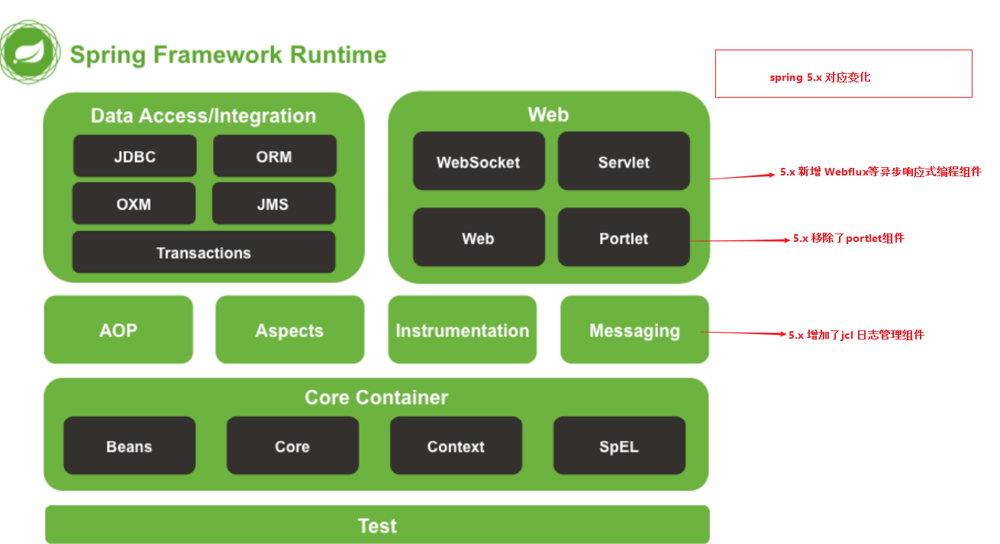

# 1. Spring
## 1.1. 简介

需要使用的 jar 包：
```xml
<!-- https://mvnrepository.com/artifact/org.springframework/spring-webmvc -->
<dependency>
    <groupId>org.springframework</groupId>
    <artifactId>spring-webmvc</artifactId>
    <version>5.2.0.RELEASE</version>
</dependency>

<!-- https://mvnrepository.com/artifact/org.springframework/spring-jdbc -->
<dependency>
    <groupId>org.springframework</groupId>
    <artifactId>spring-jdbc</artifactId>
    <version>5.1.20.RELEASE</version>
</dependency>

```
## 1.2. 优点

1. Spring 是一个开源的框架（容器）。
2. Spring 是一个轻量级， 非侵入式的框架。
3. 控制反转 （IOC）， 面向切面编程 （AOP）.
4. 支持事务的处理， 对框架整合支持。

Spring 是一个轻量级的控制反转和面向切面编程的框架。

## 1.3. 组成



# 2. IOC 理论


